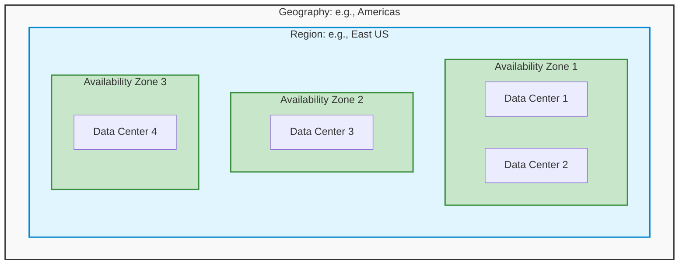

# Module 1: Prerequisites & Core Cloud Concepts

Before managing resources in Azure, you must understand the underlying physics of cloud computing. The AZ-104 exam does not explicitly test "What is cloud computing?", but it **heavily tests** your understanding of how Azure's physical infrastructure affects high availability, disaster recovery, and billing.

---

## 1. The Financial Model: CapEx vs. OpEx

Understanding the shift in how IT is paid for is fundamental.
- **CapEx (Capital Expenditure):** The traditional on-premises model. You buy the physical servers, switches, and cooling upfront. You pay whether you use 10% of the server or 100%.
- **OpEx (Operational Expenditure):** The Cloud model. You rent the hardware. You pay only for what you consume (e.g., per minute or per gigabyte).

> [!IMPORTANT]
> **Exam Gotcha:** Whenever a scenario asks how to move from a fixed upfront cost model to a consumption-based model, the answer is always migrating to OpEx via the Cloud.

---

## 2. Cloud Service Models (IaaS vs PaaS vs SaaS)

Azure operates on a shared responsibility model. As an Administrator, your responsibilities change depending on the service model.

- **IaaS (Infrastructure as a Service):** Examples: *Virtual Machines, VNet*. You rent the raw metal and hypervisor. 
  - **You manage:** The OS, updates, runtime, data, and applications.
  - **Microsoft manages:** The physical servers, networking, and virtualization layer.
- **PaaS (Platform as a Service):** Examples: *Azure App Service, Azure SQL*. You rent a pre-configured platform.
  - **You manage:** The application code and your data.
  - **Microsoft manages:** The OS, patching, hardware, and runtime.
- **SaaS (Software as a Service):** Examples: *Microsoft 365, Teams*. You rent a finished product.
  - **You manage:** Access and data.
  - **Microsoft manages:** Everything else.

---

## 3. Core Azure Architecture (The Physical Layout)

The most critical prerequisite concept for AZ-104 is understanding how Microsoft physically organizes its data centers. This determines how you architect solutions for High Availability (HA).



### Regions
A Region is a geographical perimeter containing one or more datacenters in close proximity (e.g., *East US*, *UK South*). 
- **Rule:** Resources are created in a specific Region.
- **Latency:** Always choose a Region closest to your users.
- **Pairs:** Every Region is paired with another Region within the same geography (e.g., East US is paired with West US) to allow for Disaster Recovery (DR) updates without taking down the whole country.

### Availability Zones (AZs)
An Availability Zone is a physically separate location *within* a single Azure Region.
- Each Zone is made up of one or more datacenters equipped with independent power, cooling, and networking.
- **Purpose:** Protects your apps from a total datacenter failure (e.g., a localized fire or flood).
- **Caveat:** Not all Regions support Availability Zones.

> [!WARNING]
> **Exam Gotcha:** If a question asks how to protect an application from a *datacenter failure*, the answer involves **Availability Zones**. If it asks how to protect against a *regional disaster* (e.g., a hurricane wiping out East US), the answer involves **Geo-Redundancy (paired regions)**.

---

## 4. Subscriptions and Management Groups

Before you can provision a single VM, you need an Azure Subscription. A subscription is your billing boundary.

1. **Management Groups:** Containers that help you manage access, policy, and compliance across multiple subscriptions.
2. **Subscriptions:** Groups together resources and serves as a billing and access boundary.
3. **Resource Groups:** Logical folders within a subscription that hold related resources (e.g., a Web App, its database, and its storage account).
4. **Resources:** The actual instances (VMs, VNets, SQL databases).

---

## 5. Portal Walkthrough: "Where to Click"

Since you must be familiar with the Azure Portal interface, here is your mental map of where things live.

* **To create a resource:** 
  * Click the `+ Create a resource` button (top left corner) -> Search the Marketplace for the service (e.g., "Windows Server 2022").
* **To check billing:** 
  * Search the top search bar for `Cost Management + Billing` -> Select your subscription -> Click `Cost analysis`.
* **To open Cloud Shell:** 
  * Click the `>_` icon in the top right navigation bar (next to the search bar and notification bell).

---

## 6. CLI & PowerShell Cheatsheet

As an administrator, automation is key. The exam will test your ability to recognize the correct syntax for both PowerShell and the Azure CLI.

### PowerShell Syntax (`Az` Module)
PowerShell commands follow a strict `Verb-Noun` format. All Azure nouns are prefixed with `Az`.
```powershell
# Connect to your Azure account
Connect-AzAccount

# Create a new Resource Group
New-AzResourceGroup -Name "MyRG" -Location "EastUS"

# Get a list of all VMs in a specific resource group
Get-AzVM -ResourceGroupName "MyRG"
```

### Azure CLI Syntax (`az`)
The Azure CLI follows an `az <group> <action>` format. It is cross-platform.
```bash
# Connect to your Azure account
az login

# Create a new Resource Group
az group create --name "MyRG" --location "eastus"

# Get a list of all VMs
az vm list --resource-group "MyRG" --output table
```

> [!TIP]
> If a command starts with `New-Az`, it is PowerShell. If a command starts with `az`, it is the Azure CLI. The exam will often mix these up in the multiple-choice options to trick you.
