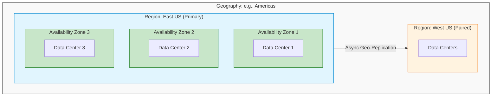
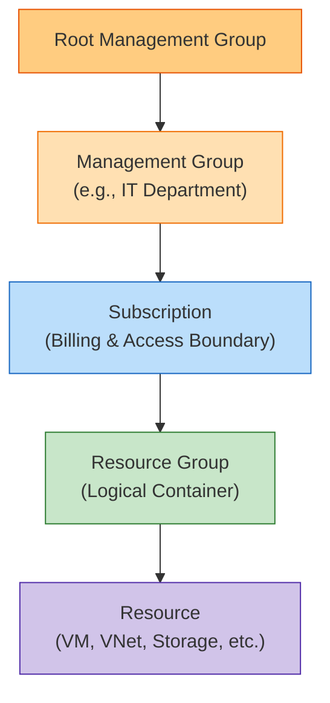

# Module 1: Prerequisites & Core Cloud Concepts

Before managing resources in Azure, you must understand the underlying physics of cloud computing. The AZ-104 exam does not explicitly test "What is cloud computing?", but it **heavily tests** your understanding of how Azure's physical infrastructure affects high availability, disaster recovery, and billing.

---

## 1. The Financial Model: CapEx vs. OpEx

Understanding the shift in how IT is paid for is fundamental.

| Model | Definition | Who Manages Hardware | When You Pay |
| :--- | :--- | :--- | :--- |
| **CapEx** (Capital Expenditure) | Buy physical servers, switches, cooling upfront. | You | Upfront, regardless of utilization |
| **OpEx** (Operational Expenditure) | Rent hardware from the cloud provider. | Cloud Provider | Pay-as-you-consume (per minute / per GB) |

> [!IMPORTANT]
> **Exam Gotcha:** Whenever a scenario asks how to move from a fixed upfront cost model to a consumption-based model, the answer is always migrating to OpEx via the Cloud.

---

## 2. Cloud Service Models (IaaS vs. PaaS vs. SaaS)

Azure operates on a shared responsibility model. Your responsibilities change depending on the service model.

| Layer | IaaS | PaaS | SaaS |
| :--- | :--- | :--- | :--- |
| **Examples** | VM, VNet, Managed Disks | App Service, Azure SQL, AKS | Microsoft 365, Teams |
| **You manage** | OS, updates, runtime, data, apps | Application code and data | Access control and data |
| **Microsoft manages** | Physical servers, networking, virtualization | OS, patching, hardware, runtime | Everything |
| **Control level** | Highest | Medium | Lowest |
| **Typical use case** | Lift-and-shift migrations | Modern app development | End-user productivity |

> [!TIP]
> **Pattern to remember:** The more "managed" the service (PaaS/SaaS), the less you control - but also the less you maintain. IaaS gives full control at the cost of operational burden.

---

## 3. Core Azure Architecture (The Physical Layout)

The most critical prerequisite concept for AZ-104 is understanding how Microsoft physically organizes its data centers. This determines how you architect for High Availability (HA) and Disaster Recovery (DR).



### Infrastructure Building Blocks

| Concept | Definition | Scope | Protects Against |
| :--- | :--- | :--- | :--- |
| **Data Center** | Single physical building with servers, power, and cooling. | Building | Hardware failure |
| **Availability Zone (AZ)** | One or more data centers with independent power/network/cooling within a region. | District | Data center fire, flood, or outage |
| **Region** | A set of data centers (often with multiple AZs) deployed within a latency-defined perimeter. | City/State | Single-zone failure |
| **Region Pair** | Two regions within the same Geography, used for DR and planned update sequencing. | Country/Continent | Regional disaster (hurricane, major outage) |
| **Geography** | A discrete market (Americas, Europe, Asia Pacific) containing two or more regions. | Continent | Data sovereignty boundaries |

> [!WARNING]
> **Exam Gotcha:** If a question asks how to protect against a *datacenter failure*, the answer involves **Availability Zones**. If it asks to protect against a *regional disaster* (e.g., a hurricane wiping out East US), the answer involves **Geo-Redundancy (paired regions)**.

---

## 4. Azure Management Hierarchy

Every resource in Azure sits within a strict hierarchy. Policies and RBAC permissions flow **downward** from parent to child scopes.



| Level | Purpose | Key Fact |
| :--- | :--- | :--- |
| **Management Group** | Groups subscriptions for unified policy and RBAC management. | Up to 6 levels of nesting. Root MG is the top. |
| **Subscription** | Billing and access boundary. All resource costs are billed here. | Limits apply per subscription (e.g., 980 VNets). |
| **Resource Group** | Logical container for related resources with a shared lifecycle. | Resources can be moved between RGs. Deleting an RG deletes all resources in it. |
| **Resource** | The actual Azure service instance (VM, Storage Account, etc.). | Must belong to exactly one RG and one Region. |

> [!WARNING]
> **Exam Gotcha:** A resource can only exist in **one** Resource Group, but a Resource Group can contain resources from **multiple** regions. The Resource Group itself has a location - but that location is only for storing the metadata, not where the resources run.

---

## 5. Availability SLA Comparison

| Deployment Configuration | SLA | Protects Against |
| :--- | :--- | :--- |
| Single VM with Premium SSD | 99.9% | Hardware failure (best-effort) |
| 2+ VMs in Availability Set | 99.95% | Rack-level (Fault Domain) failures and planned maintenance |
| 2+ VMs in Availability Zones | 99.99% | Full datacenter failure |
| Multi-region Active-Active | 99.99%+ | Regional disaster |

> [!IMPORTANT]
> **Exam Gotcha:** A single VM only gets a 99.9% SLA if it uses **Premium SSD or Ultra Disk**. Standard HDD/SSD single VMs have no Microsoft-backed SLA. This is a common exam trap.

---

## 6. Portal Walkthrough: "Where to Click"

* **To create a resource:**
  * Click the `+ Create a resource` button (top left corner) -> Search the Marketplace for the service (e.g., "Windows Server 2022").
* **To check billing:**
  * Search the top bar for `Cost Management + Billing` -> Select your subscription -> Click `Cost analysis`.
* **To open Cloud Shell:**
  * Click the `>_` icon in the top right navigation bar (next to the search bar and notification bell).
* **To view Management Groups:**
  * Search for `Management Groups` in the top bar -> Navigate the hierarchy to see how subscriptions are organized.

---

## 7. CLI & PowerShell Cheatsheet

As an administrator, automation is key. The exam tests your ability to recognize the correct syntax for both PowerShell and the Azure CLI.

### PowerShell Syntax (`Az` Module)
PowerShell commands follow a strict `Verb-Noun` format. All Azure nouns are prefixed with `Az`.
```powershell
# Connect to your Azure account
Connect-AzAccount

# Create a new Resource Group
New-AzResourceGroup -Name "MyRG" -Location "EastUS"

# Get a list of all VMs in a specific resource group
Get-AzVM -ResourceGroupName "MyRG"

# Move a resource to a different Resource Group
Move-AzResource -ResourceId <ResourceId> -DestinationResourceGroupName "TargetRG"
```

### Azure CLI Syntax (`az`)
The Azure CLI follows an `az <group> <action>` format. It is cross-platform.
```bash
# Connect to your Azure account
az login

# Create a new Resource Group
az group create --name "MyRG" --location "eastus"

# Get a list of all VMs
az vm list --resource-group "MyRG" --output table

# List all subscriptions accessible to your account
az account list --output table
```

> [!TIP]
> If a command starts with `New-Az`, `Get-Az`, or `Set-Az`, it is **PowerShell**. If it starts with `az`, it is the **Azure CLI**. The exam will mix these in multiple-choice options to trick you.
