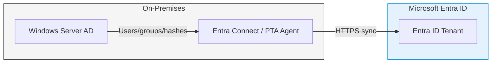
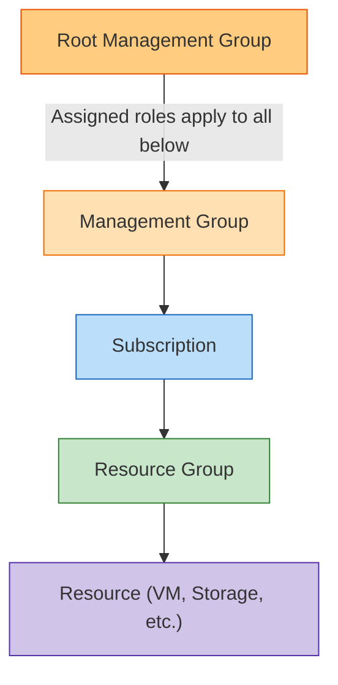

# Module 2: Manage Azure Identities and Governance

This domain accounts for roughly 15-20% of the AZ-104 exam. It forms the security foundation of everything you do in Azure.

---

## 1. Microsoft Entra ID (Formerly Azure AD)

Microsoft Entra ID is Azure's cloud-based Identity and Access Management (IAM) service.

### Core Identity Concepts

| Concept | Definition | Key Difference |
| :--- | :--- | :--- |
| **Authentication (AuthN)** | Proving *who* you are (login + MFA). | Handled by Entra ID |
| **Authorization (AuthZ)** | Determining *what* you can do after login. | Handled by Azure RBAC |
| **Entra ID (Cloud)** | Cloud-native IAM using HTTPS/OAuth/OIDC. | NOT the same as on-prem AD |
| **Windows Server AD** | On-premises directory using Kerberos/LDAP. | Sync to Entra ID via Entra Connect |
| **Tenant** | A dedicated Entra ID instance for your organization. | One per org; tied to a primary domain |

### Entra ID Editions & Licensing

| Feature | Free | P1 | P2 |
| :--- | :---: | :---: | :---: |
| Basic SSO (up to 10 apps) | YES | YES | YES |
| MFA (via Security Defaults) | YES | YES | YES |
| **Conditional Access Policies** | NO | YES | YES |
| **SSPR with on-prem writeback** | NO | YES | YES |
| **Group-based Licensing** | NO | YES | YES |
| **Identity Protection (risk-based)** | NO | NO | YES |
| **Privileged Identity Management (PIM)** | NO | NO | YES |
| **Access Reviews** | NO | NO | YES |

> [!WARNING]
> **Exam Gotcha:** Enforcing MFA *only when users log in from unknown locations* requires **Conditional Access (Entra P1)**. Security Defaults apply MFA broadly to everyone and cannot be scoped.

---

## 2. Hybrid Identity

Most enterprises sync on-premises Active Directory to Entra ID using **Microsoft Entra Connect**.



### Authentication Methods Compared

| Method | Password Stored in Cloud? | On-Prem Server Required? | Resilience if On-Prem is Down |
| :--- | :---: | :---: | :--- |
| **Password Hash Sync (PHS)** | YES (hash only) | NO | Users can still log in |
| **Pass-through Auth (PTA)** | NO | YES | Login fails |
| **Federation (AD FS)** | NO | YES | Login fails |

> [!IMPORTANT]
> **Exam Gotcha:** With PTA or AD FS, if on-premises servers go offline, cloud users **cannot log in**. PHS is more resilient because the hash is already in Entra ID.

---

## 3. Role-Based Access Control (RBAC)

RBAC controls *what* a user can do with Azure resources. Permissions inherit **downward** from parent scopes.



### Built-in RBAC Roles

| Role | Read | Create/Modify | Delete | Manage IAM Access |
| :--- | :---: | :---: | :---: | :---: |
| **Owner** | YES | YES | YES | YES |
| **Contributor** | YES | YES | YES | NO |
| **Reader** | YES | NO | NO | NO |
| **User Access Administrator** | YES | NO | NO | YES |

> [!WARNING]
> **Exam Gotcha:** A **Contributor** can create and modify resources but **cannot** grant access to others. Only **Owner** or **User Access Administrator** can manage role assignments.

### Custom RBAC Roles (JSON Definition)

- `"Actions"`: What the role *can* do (e.g., `"Microsoft.Compute/virtualMachines/*"`)
- `"NotActions"`: Permissions explicitly subtracted (e.g., deny delete on everything)
- `"DataActions"`: Data-plane operations (e.g., reading blob content)
- `"AssignableScopes"`: Where the role can be assigned (e.g., a specific subscription)

---

## 4. Azure Policy

While RBAC controls *who* can do something, **Azure Policy** controls *what* can be done - regardless of who is doing it.

### Policy Effects (Evaluated in this order)

| Effect | What It Does | Example Use Case |
| :--- | :--- | :--- |
| **Disabled** | Policy rule is ignored. | Testing/development |
| **Append** | Adds fields to resource on create/update. | Auto-add required tags |
| **Deny** | Blocks the request immediately. | Block resources outside allowed regions |
| **Audit** | Allows the action but logs non-compliance. | Report VMs without backup enabled |
| **AuditIfNotExists** | Audits if a related resource is missing. | Audit VMs missing an antivirus extension |
| **Modify** | Alters request (add/replace/remove tags). | Enforce mandatory cost-center tag |
| **DeployIfNotExists** | Deploys a missing resource as remediation. | Auto-deploy Log Analytics agent to VMs |

> [!IMPORTANT]
> **Exam Gotcha:** If the Subscription **Owner** tries to deploy a VM in `US East` but a **Deny** policy at the Management Group restricts to `UK South`, the deployment **FAILS**. Azure Policy overrides RBAC - no permissions level bypasses a Deny policy.

---

## 5. Microsoft Entra Groups

| Group Type | Membership | License Needed |
| :--- | :--- | :--- |
| **Assigned** | Manually add individual users/devices. | Free |
| **Dynamic User** | Auto-populated via attribute rules (e.g., `user.department -eq "IT"`). | Entra P1 |
| **Dynamic Device** | Auto-populated based on device attributes. | Entra P1 |

> [!WARNING]
> **Exam Gotcha:** Dynamic group rules require **Entra ID P1**. Auto-adding users based on department or job title is not available on the Free tier.

---

## 6. Identity Governance Features

| Feature | What It Does | License |
| :--- | :--- | :--- |
| **PIM (Privileged Identity Management)** | Just-in-time elevated access with approval + MFA. | P2 |
| **Access Reviews** | Periodically recertify group/app/role memberships. | P2 |
| **SSPR** | Users reset own passwords without calling IT. | P1 (on-prem writeback) |
| **Conditional Access** | Control access based on user, location, device, risk. | P1 |
| **Identity Protection** | Detect and auto-respond to identity-based risks. | P2 |

---

## 7. Governance Best Practices

- **Apply least privilege RBAC:** Use Reader by default; elevate only when needed.
- **Use Management Groups for policy inheritance:** Apply org-wide policies at the root level.
- **Tag everything:** Enforce mandatory tags with Azure Policy `Append` or `Modify`.
- **Enable PIM for privileged roles:** No standing Global Administrator access.
- **Use Conditional Access over Security Defaults:** Security Defaults are all-or-nothing; Conditional Access is granular.
- **Send Entra logs to Log Analytics:** Sign-in and Audit logs for long-term retention and KQL querying.

---

## 8. Portal Walkthrough: "Where to Click"

* **To create a Dynamic User Group:**
  * `Microsoft Entra ID` -> `Groups` -> `New group` -> Set "Membership type" to `Dynamic User` -> Click `Add dynamic query`.
* **To assign an RBAC Role:**
  * Navigate to the resource -> Click `Access control (IAM)` -> Click `+ Add` -> `Add role assignment`.
* **To create an Azure Policy:**
  * Search `Policy` -> Click `Definitions` to create the rule -> Click `Assignments` to apply it to a scope.
* **To activate a PIM role:**
  * `Microsoft Entra ID` -> `Privileged Identity Management` -> `My roles` -> Click `Activate`.

---

## 9. CLI & PowerShell Cheatsheet

### PowerShell
```powershell
# List all built-in and custom roles
Get-AzRoleDefinition

# Assign Contributor role to a user on a Resource Group
New-AzRoleAssignment -SignInName "user@contoso.com" -RoleDefinitionName "Contributor" -ResourceGroupName "MyRG"

# List all role assignments at subscription scope
Get-AzRoleAssignment -Scope "/subscriptions/<sub-id>"
```

### Azure CLI
```bash
# Create a Policy Assignment to enforce region
az policy assignment create --name "EnforceUKLocation" --policy "allowed-locations" --params "{'allowedLocations': {'value': ['uksouth']}}"

# List all role assignments
az role assignment list --all --output table

# Create a custom role from JSON file
az role definition create --role-definition custom-role.json
```
