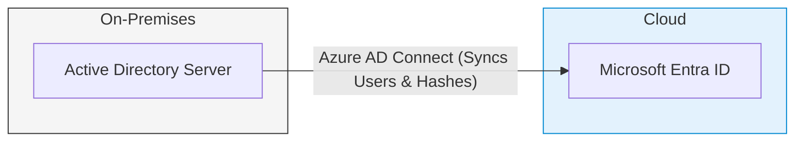
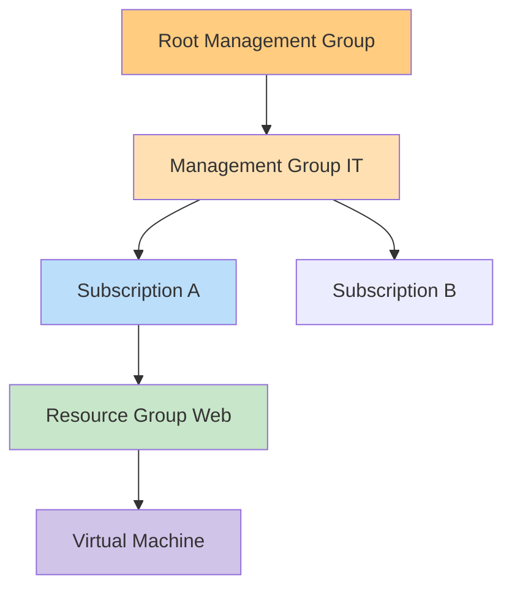

# Module 2: Manage Azure Identities and Governance

This domain accounts for roughly 15-20% of the AZ-104 exam. It forms the security foundation of everything you do in Azure. If you do not configure identity and governance correctly, your architecture is inherently compromised.

---

## 1. Microsoft Entra ID (Formerly Azure AD)

Microsoft Entra ID is Azure's cloud-based Identity and Access Management (IAM) service. It is fundamentally different from on-premises Active Directory (Windows Server AD).

### The First Principle: Authentication vs. Authorization
- **Authentication (AuthN):** Proving *who* you are (e.g., logging in with a username, password, and MFA). Handled by Entra ID.
- **Authorization (AuthZ):** Determining *what* you can do once authenticated (e.g., "Can this user delete the database?"). Handled by Azure RBAC (Role-Based Access Control).

### Entra ID Editions & Licensing
The exam strictly tests your knowledge of what features require premium licenses.

| Feature | Entra ID Free | Entra ID P1 | Entra ID P2 |
| :--- | :--- | :--- | :--- |
| Basic Login / SSO (Up to 10 apps) | ✅ Yes | ✅ Yes | ✅ Yes |
| MFA (via Security Defaults) | ✅ Yes | ✅ Yes | ✅ Yes |
| **Conditional Access Policies** | ❌ No | ✅ Yes | ✅ Yes |
| **Self-Service Password Reset (SSPR) with Writeback** | ❌ No | ✅ Yes | ✅ Yes |
| Identity Protection (Risk-based policies) | ❌ No | ❌ No | ✅ Yes |
| Access Reviews & Privileged Identity Management (PIM) | ❌ No | ❌ No | ✅ Yes |

> [!WARNING]
> **Exam Gotcha:** If a question asks how to enforce MFA *only when users log in from an unknown location or specific device*, the answer is **Conditional Access**, which strictly requires **Entra ID P1**.

---

## 2. Hybrid Identity (Connecting On-Premises to Azure)

Most enterprises do not start in the cloud. They have local Windows Servers with Active Directory. To sync these local users to Microsoft Entra ID, you use a tool called **Azure AD Connect**.



### Authentication Methods
1. **Password Hash Synchronization (PHS):** The simplest method. A hash of the user's password is synced to the cloud. Entra ID validates the login directly.
2. **Pass-through Authentication (PTA):** No password hashes are synced to the cloud. Entra ID passes the login request back to an agent on your on-premises server to validate the password. *(Used for strict security policies).*
3. **Federation (AD FS):** Complex. All authentication is redirected to an on-premises federation server.

---

## 3. Role-Based Access Control (RBAC)

RBAC controls *what* a user can do with Azure resources. It is an **additive** model, meaning permissions inherit downwards and you receive the most permissive combination.

### Scope Hierarchy


If you assign the **Reader** role at `Subscription A` and the **Contributor** role at `Resource Group Web`, the user will have **Contributor** access to the Virtual Machine, because the lower-level assignment overrides the restrictive higher-level one.

### Custom RBAC Roles
If the built-in roles (Owner, Contributor, Reader) don't fit, you create a Custom Role using a JSON file.
- `"Actions"`: What the role *can* do.
- `"NotActions"`: What is explicitly subtracted from the `Actions` list (e.g., Allow `*` but NotAction `Delete`).
- `"AssignableScopes"`: Where this role is allowed to be assigned (e.g., a specific Subscription).

---

## 4. Azure Policy

While RBAC controls *who* can do something, Azure Policy controls *what* can be done, regardless of who is doing it.

- **Example 1:** A policy forces all new storage accounts to use HTTPS.
- **Example 2:** A policy blocks anyone from deploying resources outside of the `UK South` region.

> [!IMPORTANT]
> **Exam Gotcha:** If the Subscription Owner tries to create a VM in `US East`, but an Azure Policy at the Management Group restricts deployments to `UK South`, the deployment will **FAIL**. Azure Policy always overrides RBAC permissions.

### Policy Effects
- `Deny`: Blocks the action immediately.
- `Audit`: Allows the action but logs a warning in Azure Security Center.
- `Modify`: Alters the request during deployment (e.g., automatically adds a mandatory Tag).
- `DeployIfNotExists`: Automatically deploys a missing prerequisite.

---

## 5. Portal Walkthrough: "Where to Click"

* **To create a Dynamic User Group:**
  * Navigate to `Microsoft Entra ID` -> Click `Groups` -> `New group` -> Change "Membership type" to `Dynamic User` -> Click `Add dynamic query` to write the rule (e.g., `user.department -eq "IT"`).
* **To assign an RBAC Role:**
  * Navigate to the target resource (e.g., a Resource Group) -> Click `Access control (IAM)` on the left menu -> Click `+ Add` -> `Add role assignment`.
* **To create an Azure Policy:**
  * Search the top bar for `Policy` -> Click `Definitions` to create the rule -> Click `Assignments` to apply it to a scope.

---

## 6. CLI & PowerShell Cheatsheet

### PowerShell
```powershell
# Get a list of all built-in and custom roles
Get-AzRoleDefinition

# Assign a user the Contributor role to a specific Resource Group
New-AzRoleAssignment -SignInName "user@contoso.com" -RoleDefinitionName "Contributor" -ResourceGroupName "MyRG"
```

### Azure CLI
```bash
# Create a new Azure Policy Assignment
az policy assignment create --name "EnforceUKLocation" --policy "allowed-locations" --params "{'allowedLocations': {'value': ['uksouth']}}"

# List all role assignments in a subscription
az role assignment list --all --output table
```
