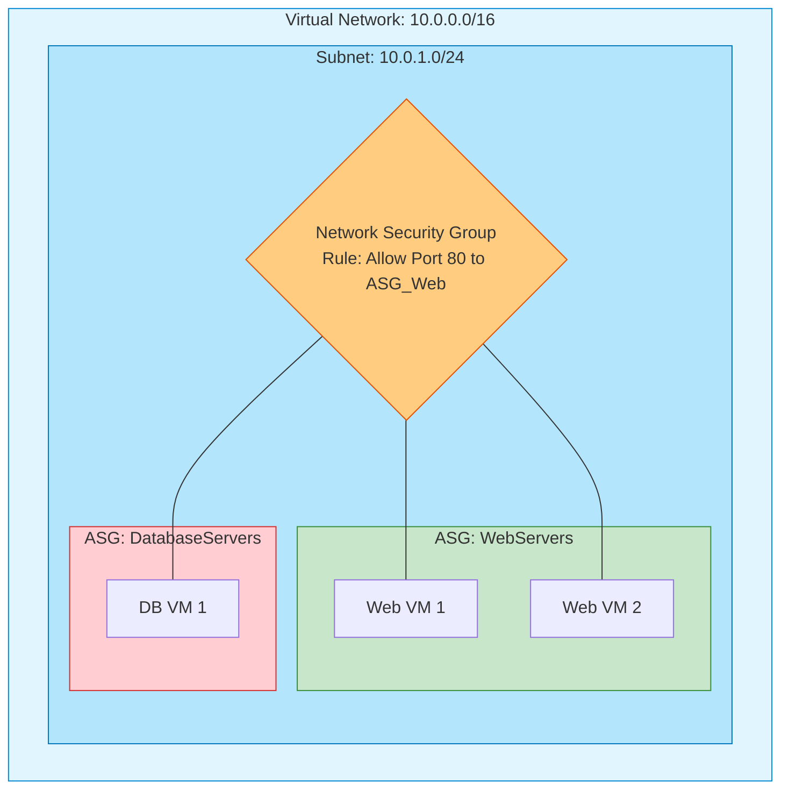
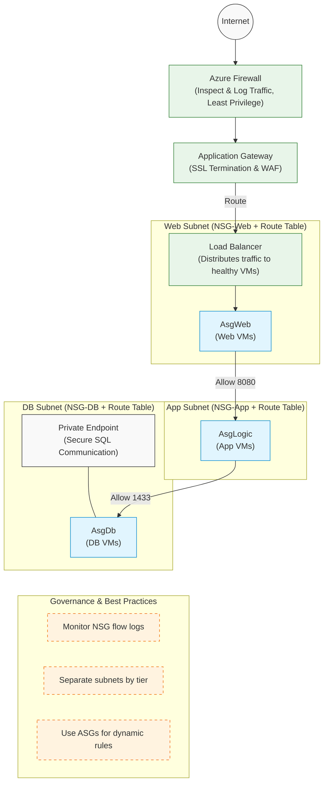

# Module 3: Configure and Manage Virtual Networks

Virtual Networking is the backbone of Azure infrastructure. It is often the most heavily weighted domain on the AZ-104 exam. If resources cannot communicate securely, your deployment fails.

---

## 1. Anatomy of a Virtual Network (VNet) and Subnets

A **Virtual Network (VNet)** is your fundamental, isolated network in the cloud.
- A VNet is bound to a single **Region** and a single **Subscription**.
- A VNet is divided into **Subnets** to organize and secure resources.

### 🧩 Core Networking Concepts

- **IP Address:** A 32-bit number identifying a device (e.g., `10.0.0.5`). Divided into a network part and a host part.
- **Subnet Mask:** Defines which bits are network (locked) and which are host (free). Example: `/24` = `255.255.255.0`.
- **CIDR Notation (Classless Inter-Domain Routing):** Compact way to write IP + mask (e.g., `10.0.0.0/24`). The number after the slash `/` indicates the network bits. Larger prefix = smaller subnet.

### 🏷️ Address Types to Know

| Address Type | Definition / Usage | Examples |
| :--- | :--- | :--- |
| **Private IP (RFC 1918)** | Internal, non-routable on the internet. Used for VNets. | `10.0.0.0/8`, `172.16.0.0/12`, `192.168.0.0/16` |
| **Public IP** | Globally unique, internet-routable. Required for external access. | `8.8.8.8` |
| **Loopback** | Traffic never leaves the machine. | `127.0.0.1` |
| **Link-local (APIPA)** | Self-assigned when DHCP fails. Not routed. | `169.254.0.0/16` |
| **Shared Address Space** | Carrier-grade NAT (RFC 6598). **NEVER use in Azure.** | `100.64.0.0/10` |

> [!WARNING]
> **Exam Gotcha - IP Ranges to Avoid:**
> - Never use `100.64.0.0/10` in VNets! Microsoft uses this internally for the Azure backbone. If used, traffic silently misroutes.
> - `192.168.x.x` is common in home/office networks, causing VPN conflicts. Stick to `10.0.0.0/8` where possible.
> - Blackholed documentation ranges (e.g., `192.0.2.0`, `198.51.100.0`) go nowhere.

### 🔒 The 5 Azure Reserved IPs

In **every** subnet, regardless of size, Azure always reserves exactly 5 IP addresses. They cannot be assigned to VMs or services.
This means: **`Usable IPs = 2^(32 - prefix) − 5`**

1. **`.0`** - Network Address
2. **`.1`** - Default Gateway (Router)
3. **`.2`** - Azure internal DNS
4. **`.3`** - Azure internal DNS (future use)
5. **`.255`** - Network Broadcast

*Because it's a fixed 5 IPs, small subnets (like `/29` which has 8 IPs total) are penalized far more heavily than large ones (like `/24`).*

### ✨ Two Magic IPs in Azure (DO NOT BLOCK)

If you block these via Network Security Groups (NSGs) or Firewalls, Azure infrastructure will break:
1. **`168.63.129.16`**: Virtual Public IP. Used by Azure to facilitate Load Balancer health probes, DNS queries, and VM guest agent activation.
2. **`169.254.169.254`**: Instance Metadata Service (IMDS). VMs query this IP to retrieve identity info, managed identity tokens, and tags. Never leaves the host.

### 📐 Subnet Sizing & Azure Recommendations

| CIDR | Usable IPs (after 5 reserved) | Recommended Azure Use Case |
| :--- | :--- | :--- |
| **`/29`** | 3 | Minimum allowed in Azure. |
| **`/28`** | 11 | Small services, isolated jump boxes. |
| **`/27`** | 27 | `GatewaySubnet` (Recommended minimum). |
| **`/26`** | 59 | `AzureBastionSubnet` (Required min) / `AzureFirewallSubnet` (Required min). |
| **`/24`** | 251 | Standard go-to for most production workloads and App Gateway v2. |
| **`/22` to `/20`** | ~1,000 to ~4,000 | AKS (Kubernetes) – Pods consume IPs very rapidly. |
| **`/16`** | 65,531 | Typically used for the entire VNet address space block. |

> [!IMPORTANT]
> **Exam Gotcha - Subnet Requirements:** 
> - `AzureBastionSubnet` **must** be at least `/26` or larger.
> - `AzureFirewallSubnet` **must** be at least `/26` or larger.
> - `GatewaySubnet` works on `/29`, but Microsoft strongly recommends `/27` or larger to accommodate future gateway upgrades.

---

## 2. Network Security Groups (NSGs) vs. Application Security Groups (ASGs)

### NSG (The Firewall)
An NSG is a basic network filter containing allow/deny rules based on source, destination, port, and protocol. 
- NSGs can be applied to **Subnets** or directly to **Network Interfaces (NICs)**.
- **Rule Priority:** Rules are evaluated by priority number (100 to 4096). The **lowest number** wins. Once a match is found, evaluation stops.

### ASG (The Logical Grouping)
An ASG allows you to group VMs by their function (e.g., "WebServers" or "DatabaseServers") instead of managing their IP addresses individually.



---

## 3. VNet Peering

By default, VNets are completely isolated. Traffic in VNet A cannot reach VNet B. **VNet Peering** connects them seamlessly over the Microsoft backbone network (not the public internet).

### Transitivity Rule (CRITICAL)
VNet Peering is **non-transitive**. 

If VNet A is peered to VNet B, and VNet B is peered to VNet C:
- VNet A **CANNOT** talk to VNet C. You must explicitly create a peering between A and C, or route traffic through a Network Virtual Appliance (Firewall) in VNet B.

> [!IMPORTANT]
> **Exam Gotcha:** Almost every AZ-104 exam features a transitivity question. If A is peered to B, and B to C, A and C are *isolated* until you bridge them directly or use a hub-and-spoke router.

---

## 4. Securing PaaS Services (Endpoints)

By default, Azure PaaS services (like Storage Accounts or SQL Databases) sit on the public internet. You secure them using Endpoints.

1. **Service Endpoint:** Gives your VNet a direct, optimized route to the PaaS service over the Azure backbone. *The PaaS service still retains its public IP address*, but you firewall it to only accept traffic from your VNet.
2. **Private Endpoint:** Brings the PaaS service entirely inside your VNet by giving it a **Private IP** from your subnet. The public IP is effectively removed from the routing space. *This is the most secure method.*

---

## 5. 🌐 Core Networking Services and Their Roles

| Service | Definition | Purpose / Working | Best Practices |
| :--- | :--- | :--- | :--- |
| **Virtual Network (VNet)** | A private, isolated network in Azure. | Defines IP address space, subnets, and connectivity boundaries for resources. | Use CIDR blocks that don’t overlap with on‑prem networks; segment workloads by subnet. |
| **Subnet** | Logical partition of a VNet. | Groups resources for isolation and policy enforcement. | Assign NSGs per subnet; reserve space for future growth; avoid overly large subnets. |
| **Network Interface (NIC)** | Connects a VM to a subnet. | Each NIC gets a private IP and optional public IP. | Use static private IPs for servers; disable public IPs unless required. |
| **Network Security Group (NSG)** | Stateful L3/L4 firewall. | Enforces allow/deny rules for inbound/outbound traffic. | Apply least‑privilege rules; use service tags (e.g., AzureLoadBalancer) instead of IPs. |
| **Application Security Group (ASG)** | Logical grouping of VMs/NICs. | Used inside NSG rules to simplify targeting by role (Web, App, DB). | Group by function, not environment; avoid mixing tiers in one ASG. |
| **Route Table (UDR)** | Custom routing configuration. | Overrides default system routes for traffic control. | Use UDRs for NVA/firewall routing; avoid circular routes; document all custom routes. |
| **Azure Firewall** | Managed, scalable L4–L7 firewall. | Centralized traffic inspection, NAT, and logging. | Deploy in a dedicated subnet; use with forced tunneling; enable diagnostics. |
| **Load Balancer** | Distributes traffic across VMs. | Operates at L4 (TCP/UDP); supports inbound/outbound NAT. | Use Standard SKU; combine with NSGs; health probe every 5–10 s. |
| **Application Gateway** | L7 load balancer with WAF. | Handles HTTP/HTTPS, SSL termination, and path‑based routing. | Enable WAF; use autoscaling; integrate with Front Door for global reach. |
| **Private Endpoint** | Private IP access to PaaS services. | Connects services like Storage or SQL via private IP. | Disable public access; use DNS zone integration; monitor with NSG flow logs. |
| **VPN Gateway** | Secure tunnel between Azure and on‑prem. | Uses IPsec/IKE for encrypted connectivity. | Use active‑active for HA; match MTU settings; monitor latency. |
| **ExpressRoute** | Dedicated private circuit to Azure. | Bypasses Internet for predictable performance. | Use redundant circuits; integrate with Virtual WAN; plan QoS. |
| **Virtual WAN** | Global hub‑and‑spoke network service. | Centralizes connectivity, routing, and security. | Use for multi‑region or hybrid setups; pair with Azure Firewall Manager. |

---

## 6. 🔄 End‑to‑End Traffic Flow (Typical 3‑Tier Architecture)

1. **Internet → Azure Firewall**
   - Firewall inspects and filters inbound traffic.
   - Logs sent to Azure Monitor.
2. **Firewall → Application Gateway**
   - Gateway performs SSL termination and WAF inspection.
   - Routes requests based on URL paths (e.g., `/api`, `/web`).
3. **Application Gateway → Load Balancer (Web Tier)**
   - Distributes traffic across Web VMs in `AsgWeb`.
   - Health probes ensure only healthy VMs receive traffic.
4. **Web Tier → App Tier**
   - NSG rule: Allow `AsgWeb` → `AsgLogic` : `8080`.
   - ASGs dynamically apply rules to all VMs in each tier.
5. **App Tier → Database Tier**
   - NSG rule: Allow `AsgLogic` → `AsgDb` : `1433`.
   - Route Table ensures traffic stays within VNet.
6. **Database Tier → Azure SQL / Storage / Private Endpoint**
   - Private Endpoint provides secure, internal access.
   - No public exposure.

### Traffic Flow Architecture Diagram



---

## 7. 🧠 Best Practices Summary

- **Design for least privilege:** Deny all by default; explicitly allow required ports.
- **Use ASGs for scalability:** Avoid hard‑coding IPs in NSG rules.
- **Centralize security:** Use Azure Firewall or NVA in a hub‑and‑spoke model.
- **Monitor everything:** Enable NSG flow logs, diagnostic settings, and Azure Monitor alerts.
- **Separate tiers by subnet:** Web, App, and DB should each have their own subnet and NSG.
- **Use Standard SKUs:** For Load Balancer and Public IPs — they support zone redundancy.
- **Automate with ARM/Bicep:** Keep network configuration version‑controlled.
- **Plan IP space early:** Avoid overlapping CIDRs with on‑prem or other VNets.
- **Integrate with Defender for Cloud:** For continuous compliance and threat detection.

---

## 8. 🌍 How DNS Works

**When you type a domain:**
1. Your computer asks a **recursive resolver** (usually your ISP or a public DNS like `8.8.8.8`).
2. The resolver queries **authoritative name servers** for that domain.
3. Those servers return records — each record type defines what kind of information is being returned.
4. The resolver caches the result and sends the IP back to your browser.

*Each record type is a data structure describing a specific mapping or instruction.*

### 🔹 Core Record Types

| Type | Purpose | How It Works (First Principles) | Example |
| :--- | :--- | :--- | :--- |
| **A (Address)** | Maps a domain to an IPv4 address. | The most fundamental record — it’s the “phone number” of the domain. When a resolver asks for `example.com`, the A record returns `93.184.216.34`. | `example.com → 93.184.216.34` |
| **AAAA (IPv6 Address)** | Same as A, but for IPv6. | Enables modern addressing with 128-bit IPs. | `example.com → 2606:2800:220:1:248:1893:25c8:1946` |
| **CNAME (Canonical Name)** | Alias one domain to another. | Instead of storing an IP, it points to another domain that has an A record. Used for load balancing or branding. | `www.example.com → example.com` |
| **MX (Mail Exchange)** | Defines mail servers for a domain. | Tells email systems where to deliver mail. Each MX record has a priority (lower = higher priority). | `example.com → mail1.example.com (priority 10)` |
| **TXT (Text)** | Stores arbitrary text data. | Originally for notes, now used for verification (SPF, DKIM, domain ownership). | `example.com → "v=spf1 include:_spf.google.com ~all"` |
| **Wildcard (\*)** | Matches any subdomain not explicitly defined. | Acts as a catch-all rule. If `blog.example.com` doesn’t exist, `*.example.com` applies. | `*.example.com → 93.184.216.34` |

### 🔸 Governance and Control Records

| Type | Purpose | How It Works | Example |
| :--- | :--- | :--- | :--- |
| **CAA (Certificate Authority Authorization)** | Restricts which CAs can issue SSL certificates for your domain. | Prevents unauthorized certificate issuance. | `example.com → 0 issue "letsencrypt.org"` |
| **NS (Name Server)** | Points to authoritative DNS servers for the domain. | Defines who controls DNS for that zone. | `example.com → ns1.example.net, ns2.example.net` |
| **SOA (Start of Authority)** | Defines zone metadata. | Contains admin email, serial number, refresh/retry/expire times. Used for replication and caching. | `example.com → ns1.example.net admin@example.com 2026042901 7200 3600 1209600 3600` |

### ✉️ Email Authentication Records

| Type | Purpose | How It Works | Example |
| :--- | :--- | :--- | :--- |
| **SPF (Sender Policy Framework)** | Prevents email spoofing. | Stored in a TXT record; lists allowed mail servers for your domain. | `v=spf1 include:_spf.google.com ~all` |
| **DKIM (DomainKeys Identified Mail)** | Verifies message integrity. | Uses public key stored in TXT record; mail servers sign outgoing mail. | `default._domainkey.example.com → "p=MIIBIjANBg..."` |
| **DMARC (Domain-based Message Authentication, Reporting & Conformance)** | Combines SPF + DKIM + policy. | Defines how receivers handle failed authentication. | `_dmarc.example.com → "v=DMARC1; p=reject; rua=mailto:dmarc@example.com"` |

### 🧭 Service Discovery Records

| Type | Purpose | How It Works | Example |
| :--- | :--- | :--- | :--- |
| **SRV (Service Locator)** | Defines host and port for specific services. | Used by VoIP, LDAP, Minecraft, etc. Format: `_service._protocol.domain`. | `_sip._tcp.example.com → 10 60 5060 sipserver.example.com` |

### ⚙️ DNS Flow Summary

```text
Browser → Resolver → Root Server → TLD Server → Authoritative Server
→ Returns A/CNAME/MX/etc → Cached → Connection Established
```

Each record type contributes a piece of the puzzle:
- **A/AAAA** → where to connect
- **CNAME** → alias resolution
- **MX/SPF/DKIM/DMARC** → secure email routing
- **NS/SOA/CAA** → governance and trust
- **SRV/TXT/Wildcard** → service discovery and flexibility

### 🧩 DNS Best Practices

- **Use TTL wisely** — short (300 s) for dynamic IPs, long (86400 s) for stable zones.
- **Always define SOA and NS records** — they’re mandatory for zone integrity.
- **Use CAA** — prevents rogue SSL certificates.
- **Implement SPF + DKIM + DMARC** — essential for email reputation.
- **Avoid excessive CNAME chains** — they slow resolution.
- **Monitor DNS changes** — use serial numbers in SOA for version tracking.
- **Use Wildcards sparingly** — they can unintentionally expose subdomains.

---

## 9. Portal Walkthrough: "Where to Click"

* **To Peer two VNets:**
  * Navigate to your VNet -> Click `Peerings` on the left menu -> Click `+ Add`. You must configure both sides of the peering. The wizard handles this for you if you have permissions on both VNets.
* **To create an NSG Rule:**
  * Navigate to your NSG -> Click `Inbound security rules` -> Click `+ Add`. Set the Source (e.g., `Any`), Destination Port (e.g., `3389` for RDP), Action (`Deny`), and crucially, the **Priority** number.
* **To attach a Public IP to a VM:**
  * Navigate to the Virtual Machine -> Click `Networking` -> Click the name of the `Network Interface (NIC)` -> Click `IP configurations` -> Select the config and toggle Public IP to `Associate`.

---

## 10. CLI & PowerShell Cheatsheet

### PowerShell
```powershell
# Create a new Virtual Network
$subnet = New-AzVirtualNetworkSubnetConfig -Name "MySubnet" -AddressPrefix "10.0.1.0/24"
New-AzVirtualNetwork -Name "MyVNet" -ResourceGroupName "MyRG" -Location "EastUS" -AddressPrefix "10.0.0.0/16" -Subnet $subnet

# Create VNet Peering
Add-AzVirtualNetworkPeering -Name "PeerAtoB" -VirtualNetwork $vnetA -RemoteVirtualNetworkId $vnetB.Id
```

### Azure CLI
```bash
# Create a VNet and a Subnet simultaneously
az network vnet create --name "MyVNet" --resource-group "MyRG" --address-prefixes "10.0.0.0/16" --subnet-name "MySubnet" --subnet-prefixes "10.0.1.0/24"

# Create a Network Security Group rule to open Port 80
az network nsg rule create --resource-group "MyRG" --nsg-name "MyNSG" --name "AllowWeb" --priority 100 --destination-port-ranges 80 --access Allow --protocol Tcp
```
