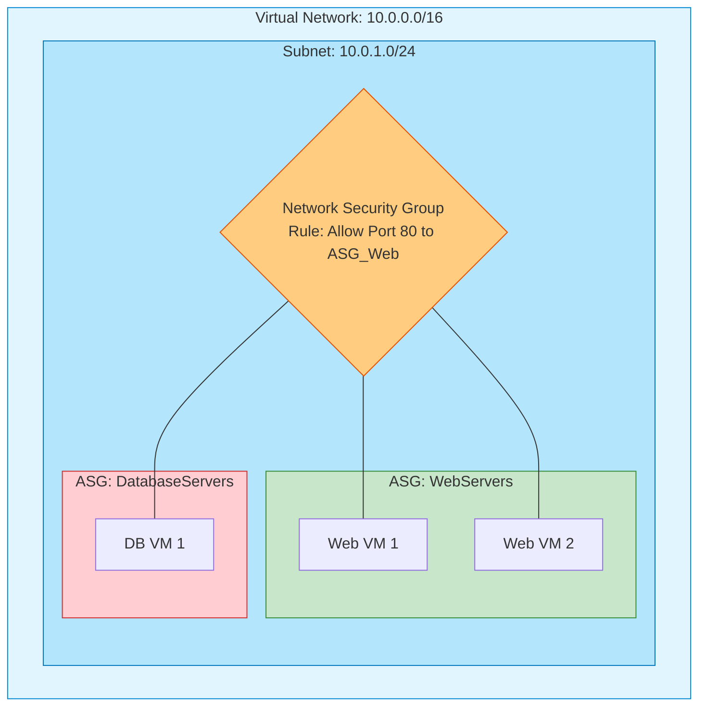

# Module 3: Configure and Manage Virtual Networks

Virtual Networking is the backbone of Azure infrastructure. It is often the most heavily weighted domain on the AZ-104 exam. If resources cannot communicate securely, your deployment fails.

---

## 1. Virtual Networks (VNets) and Subnets

A **Virtual Network (VNet)** is your fundamental, isolated network in the cloud. 
- A VNet is bound to a single **Region** and a single **Subscription**.
- A VNet is divided into **Subnets** to organize and secure resources.

### The 5 Reserved IP Addresses
When you create a subnet (e.g., `10.0.0.0/24`), Azure automatically reserves the first 4 and the last 1 IP address for internal routing. You cannot assign these to Virtual Machines.

> [!WARNING]
> **Exam Gotcha:** If an exam question asks: "You create a /29 subnet (which contains 8 IPs). How many Virtual Machines can you deploy into this subnet?" The answer is **3** (8 total - 5 reserved = 3 usable).

---

## 2. Network Security Groups (NSGs) vs. Application Security Groups (ASGs)

### NSG (The Firewall)
An NSG is a basic network filter containing allow/deny rules based on source, destination, port, and protocol. 
- NSGs can be applied to **Subnets** or directly to **Network Interfaces (NICs)**.
- **Rule Priority:** Rules are evaluated by priority number (100 to 4096). The **lowest number** wins. Once a match is found, evaluation stops.

### ASG (The Logical Grouping)
An ASG allows you to group VMs by their function (e.g., "WebServers" or "DatabaseServers") instead of managing their IP addresses individually.



---

## 3. VNet Peering

By default, VNets are completely isolated. Traffic in VNet A cannot reach VNet B. **VNet Peering** connects them seamlessly over the Microsoft backbone network (not the public internet).

### Transitivity Rule (CRITICAL)
VNet Peering is **non-transitive**. 

If VNet A is peered to VNet B, and VNet B is peered to VNet C:
- VNet A **CANNOT** talk to VNet C. You must explicitly create a peering between A and C, or route traffic through a Network Virtual Appliance (Firewall) in VNet B.

> [!IMPORTANT]
> **Exam Gotcha:** Almost every AZ-104 exam features a transitivity question. If A is peered to B, and B to C, A and C are *isolated* until you bridge them directly or use a hub-and-spoke router.

---

## 4. Securing PaaS Services (Endpoints)

By default, Azure PaaS services (like Storage Accounts or SQL Databases) sit on the public internet. You secure them using Endpoints.

1. **Service Endpoint:** Gives your VNet a direct, optimized route to the PaaS service over the Azure backbone. *The PaaS service still retains its public IP address*, but you firewall it to only accept traffic from your VNet.
2. **Private Endpoint:** Brings the PaaS service entirely inside your VNet by giving it a **Private IP** from your subnet. The public IP is effectively removed from the routing space. *This is the most secure method.*

---

## 5. Portal Walkthrough: "Where to Click"

* **To Peer two VNets:**
  * Navigate to your VNet -> Click `Peerings` on the left menu -> Click `+ Add`. You must configure both sides of the peering. The wizard handles this for you if you have permissions on both VNets.
* **To create an NSG Rule:**
  * Navigate to your NSG -> Click `Inbound security rules` -> Click `+ Add`. Set the Source (e.g., `Any`), Destination Port (e.g., `3389` for RDP), Action (`Deny`), and crucially, the **Priority** number.
* **To attach a Public IP to a VM:**
  * Navigate to the Virtual Machine -> Click `Networking` -> Click the name of the `Network Interface (NIC)` -> Click `IP configurations` -> Select the config and toggle Public IP to `Associate`.

---

## 6. CLI & PowerShell Cheatsheet

### PowerShell
```powershell
# Create a new Virtual Network
$subnet = New-AzVirtualNetworkSubnetConfig -Name "MySubnet" -AddressPrefix "10.0.1.0/24"
New-AzVirtualNetwork -Name "MyVNet" -ResourceGroupName "MyRG" -Location "EastUS" -AddressPrefix "10.0.0.0/16" -Subnet $subnet

# Create VNet Peering
Add-AzVirtualNetworkPeering -Name "PeerAtoB" -VirtualNetwork $vnetA -RemoteVirtualNetworkId $vnetB.Id
```

### Azure CLI
```bash
# Create a VNet and a Subnet simultaneously
az network vnet create --name "MyVNet" --resource-group "MyRG" --address-prefixes "10.0.0.0/16" --subnet-name "MySubnet" --subnet-prefixes "10.0.1.0/24"

# Create a Network Security Group rule to open Port 80
az network nsg rule create --resource-group "MyRG" --nsg-name "MyNSG" --name "AllowWeb" --priority 100 --destination-port-ranges 80 --access Allow --protocol Tcp
```
