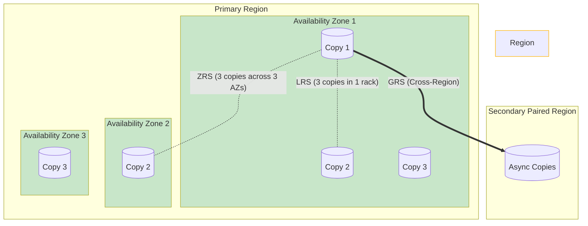

# Module 4: Implement and Manage Storage

Azure Storage is the foundation for almost all other services. Virtual Machines need storage for their disks, databases need storage for their backups, and applications need storage for their files. The AZ-104 exam heavily tests your ability to choose the most **cost-effective** and **highly available** storage option.

---

## 1. Storage Redundancy (The Exam Heavyweight)

When you save a file in Azure, Microsoft automatically keeps multiple copies of it so you don't lose data if a hard drive crashes. The question is: *where* are those copies kept?



1. **LRS (Locally Redundant Storage):** 3 copies of your data inside a *single* datacenter rack. Protects against hard drive failure, but if the datacenter floods, your data is gone. Cheapest option.
2. **ZRS (Zone-Redundant Storage):** 3 copies spread across 3 different Availability Zones in the *same* region. Protects against a datacenter burning down.
3. **GRS (Geo-Redundant Storage):** 3 copies locally (LRS), plus those copies are asynchronously replicated to a secondary region hundreds of miles away. Protects against a regional disaster (e.g., hurricane).
4. **RA-GRS (Read-Access GRS):** Same as GRS, but you can actually read the data in the secondary region even if the primary region hasn't failed yet.

> [!WARNING]
> **Exam Gotcha:** If an exam scenario asks for the absolute cheapest storage that survives a whole-region failure, the answer is **GRS**. If it asks to survive a datacenter failure but remain cost-effective, the answer is **ZRS**.

---

## 2. Blob Storage Access Tiers

Blob storage is for unstructured data (images, videos, massive logs). To save money, Azure offers different "temperatures" for your data.

* **Hot Tier:** Optimized for storing data that is accessed frequently. Highest storage costs, but lowest access (read/write) costs.
* **Cool Tier:** Optimized for data accessed infrequently (stored for at least 30 days). Lower storage costs, but higher access costs than Hot.
* **Cold Tier:** Optimized for data accessed rarely (stored for at least 90 days). 
* **Archive Tier:** Optimized for data that is rarely accessed but must be kept for years (compliance/audits). **Absolute lowest storage cost**, but data is offline. To read it, you must "rehydrate" the blob, which can take up to 15 hours and costs a lot of money.

> [!TIP]
> **Lifecycle Management:** You can create rules to automatically move blobs. E.g., "If blob hasn't been modified in 30 days, move to Cool. If 180 days, move to Archive."

---

## 3. Shared Access Signatures (SAS)

How do you give someone temporary access to a file in your secure storage account without giving them your master keys?

A **SAS Token** is a cryptographic string you append to a URL. It grants restricted, time-bound access.
- You can limit the **time** (e.g., expires in 1 hour).
- You can limit the **permissions** (e.g., Read-only, no Delete).
- You can limit the **IP Address** (e.g., only allow downloads from 192.168.1.50).

> [!IMPORTANT]
> **Exam Gotcha:** If a vendor's machine is compromised and they have an Account SAS token, the *fastest* way to revoke their access is to **Regenerate the Storage Account Access Key** that was used to sign the SAS token. This instantly breaks the token.

---

## 4. Azure File Sync

Azure File Sync is a hybrid service. It allows you to centralize your organization's file shares in Azure Files, while keeping a local cache on an on-premises Windows Server for fast access.

**Cloud Tiering:** This is the killer feature. If you have a 10 TB file share in Azure, but only a 2 TB hard drive on your local server, Cloud Tiering ensures only the most frequently used files are kept locally. The older files are replaced with "pointers" that instantly download the file from Azure when a user clicks them.

---

## 5. Portal Walkthrough: "Where to Click"

* **To change Access Tiers of a Blob:**
  * Navigate to the Storage Account -> Click `Containers` -> Open your container -> Check the box next to the blob -> Click `Change tier` -> Select Hot, Cool, Cold, or Archive.
* **To configure Lifecycle Management:**
  * Navigate to the Storage Account -> Scroll down to `Data management` on the left menu -> Click `Lifecycle management` -> Click `Add a rule`.
* **To generate a SAS Token:**
  * Navigate to the Storage Account -> Click `Shared access signature` on the left menu -> Check the allowed services and permissions -> Set the expiry date -> Click `Generate SAS and connection string`.

---

## 6. CLI & PowerShell Cheatsheet

### PowerShell
```powershell
# Create a standard general-purpose v2 storage account with LRS redundancy
New-AzStorageAccount -ResourceGroupName "MyRG" -Name "mystorageaccount123" -Location "EastUS" -SkuName "Standard_LRS"

# Get the two master access keys for a storage account
Get-AzStorageAccountKey -ResourceGroupName "MyRG" -Name "mystorageaccount123"
```

### Azure CLI
```bash
# Create a storage account with Geo-Redundancy
az storage account create --name "mystorageaccount123" --resource-group "MyRG" --location "eastus" --sku "Standard_GRS"

# Generate an Account SAS token valid for 24 hours
az storage account generate-sas --permissions cdlruwap --account-name "mystorageaccount123" --services b --resource-types co --expiry "2026-12-31T23:59:00Z"
```
