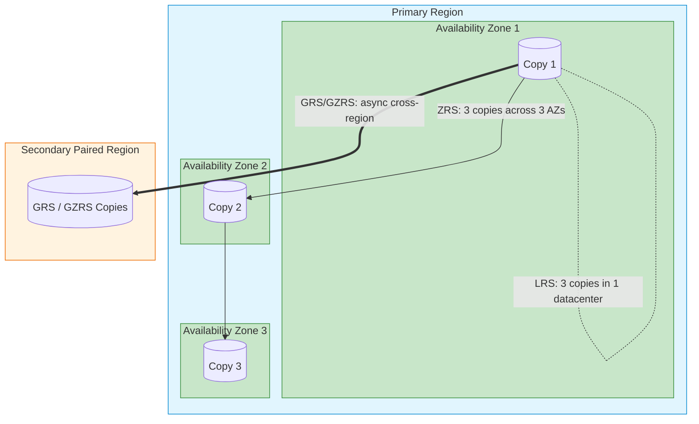
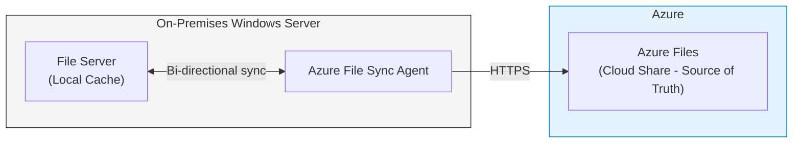

# Module 4: Implement and Manage Storage

Azure Storage is the foundation for almost all other services. VMs need storage for disks, databases need it for backups, and applications need it for files. The AZ-104 exam heavily tests choosing the most **cost-effective** and **highly available** storage option.

---

## 1. Storage Services Overview

| Service | Type of Data | Use Case |
| :--- | :--- | :--- |
| **Blob Storage** | Unstructured (images, videos, logs, backups) | Object storage; the most commonly used service |
| **Azure Files** | File shares (SMB/NFS protocols) | Lift-and-shift Windows file servers to cloud |
| **Azure Queues** | Message queue (small messages up to 64 KB) | Decoupling components; async processing |
| **Azure Tables** | NoSQL key-value pairs | Semi-structured data without complex queries |
| **Azure Disks** | Block storage for VMs | OS disks and data disks for Virtual Machines |

> [!TIP]
> **Pattern:** If the question mentions "unstructured," "object," "images," or "videos," the answer is **Blob**. If it mentions "file shares" or "SMB," it is **Azure Files**.

---

## 2. Storage Redundancy (The Exam Heavyweight)

When you save a file in Azure, Microsoft keeps multiple copies. The question is: *where* are those copies?



### Redundancy Options Compared

| Option | Copies | Where | Datacenter Failure | Zone Failure | Region Failure | Cost |
| :--- | :---: | :--- | :---: | :---: | :---: | :--- |
| **LRS** (Locally Redundant) | 3 | Single datacenter | ❌ | NO | ❌ | Lowest |
| **ZRS** (Zone Redundant) | 3 | 3 AZs, same region | ✅ | YES | ❌ | Medium |
| **GRS** (Geo Redundant) | 6 | 3 local + 3 secondary region | ✅ | ❌ | ✅ | Higher |
| **GZRS** (Geo-Zone Redundant) | 6 | 3 AZs primary + 3 secondary region | ✅ | YES | ✅ | Highest |
| **RA-GRS** | 6 | Same as GRS + readable secondary | ✅ | ❌ | ✅ | Higher |
| **RA-GZRS** | 6 | Same as GZRS + readable secondary | ✅ | YES | ✅ | Highest |

> [!WARNING]
> **Exam Gotcha:** Cheapest option that survives a **whole-region failure** = **GRS**. Survives a **datacenter failure** cost-effectively = **ZRS**. Need to **read from the secondary region** even before failover = **RA-GRS** or **RA-GZRS**.

---

## 3. Blob Storage Access Tiers

Blob storage offers different "temperature" tiers to optimize cost based on how often data is accessed.

| Tier | Access Frequency | Minimum Storage Duration | Storage Cost | Access Cost | Retrieval Time |
| :--- | :--- | :--- | :--- | :--- | :--- |
| **Hot** | Frequently | None | Highest | Lowest | Instant |
| **Cool** | Infrequently | 30 days | Lower | Medium | Instant |
| **Cold** | Rarely | 90 days | Lower | Higher | Instant |
| **Archive** | Almost never | 180 days | Lowest | Highest | Up to 15 hours (rehydration) |

> [!WARNING]
> **Exam Gotcha:** Archive tier data is **offline**. You cannot read it directly. You must first **rehydrate** it to Hot or Cool, which can take **up to 15 hours** and incurs retrieval costs. This is the most commonly tested storage trap.

### Lifecycle Management (Automate Tier Transitions)

You can create rules to automatically move blobs based on last modification or last access time:
```
"If blob hasn't been modified for 30 days → move to Cool"
"If blob hasn't been modified for 180 days → move to Archive"
"If blob hasn't been modified for 365 days → delete"
```

---

## 4. Storage Access Methods

| Method | What It Is | Scope | Revocable? | Best For |
| :--- | :--- | :--- | :--- | :--- |
| **Access Keys** | Master keys (2 per account) that grant full control. | Entire storage account | Regenerate key to revoke | Emergency access; backend services |
| **SAS Token (Account)** | Signed URL granting restricted, time-bound access. | Account, service, or object | Regenerate the signing key | Vendor/partner temporary access |
| **SAS Token (User Delegation)** | SAS signed with Entra ID credentials (not account key). | Blob/container level | Revoke user permissions | Preferred secure method |
| **Stored Access Policy** | Predefined SAS parameters attached to a container. | Container | Delete the policy | Centralized SAS management |
| **Entra ID (RBAC)** | Identity-based access using role assignments. | Account/container/blob | Remove role assignment | Internal Azure users and services |

> [!IMPORTANT]
> **Exam Gotcha:** A vendor's machine is compromised and they have a SAS token. The **fastest way to revoke access** is to **regenerate the storage account access key** used to sign the SAS. This instantly invalidates all SAS tokens signed by that key.

---

## 5. Azure File Sync

Azure File Sync is a hybrid service that centralizes file shares in Azure Files while keeping a local cache on on-premises Windows Servers.



**Cloud Tiering:** Files not recently accessed on the local server are replaced with "pointer" stubs. Clicking them instantly downloads from Azure. Only frequently accessed files are kept locally.

---

## 6. Storage Account Best Practices

- **Use ZRS or GZRS for production:** LRS is only acceptable for non-critical dev/test workloads.
- **Prefer User Delegation SAS over Account SAS:** It uses Entra ID and doesn't expose account keys.
- **Disable public blob access:** Unless explicitly needed, disable anonymous read access at the account level.
- **Use Private Endpoints:** Remove the public IP from storage accounts accessed by VNets.
- **Enable soft delete:** Protects against accidental deletion with a configurable retention window (1-365 days).
- **Enable versioning:** Keeps previous versions of blobs for point-in-time recovery.
- **Apply Lifecycle Management policies:** Automatically tier or expire data to control costs.
- **Use Lifecycle Management** to automatically move blobs from Hot -> Cool -> Archive -> Delete.

---

## 7. Portal Walkthrough: "Where to Click"

* **To change Access Tier of a Blob:**
  * Storage Account -> `Containers` -> Open container -> Check blob -> `Change tier` -> Select Hot/Cool/Cold/Archive.
* **To configure Lifecycle Management:**
  * Storage Account -> `Data management` (left menu) -> `Lifecycle management` -> `Add a rule`.
* **To generate a SAS Token:**
  * Storage Account -> `Shared access signature` -> Set permissions and expiry -> `Generate SAS and connection string`.
* **To enable Soft Delete:**
  * Storage Account -> `Data protection` (left menu) -> Toggle `Enable soft delete for blobs` -> Set retention days.

---

## 8. CLI & PowerShell Cheatsheet

### PowerShell
```powershell
# Create a standard GPv2 storage account with LRS
New-AzStorageAccount -ResourceGroupName "MyRG" -Name "mystorageacct" -Location "EastUS" -SkuName "Standard_LRS"

# Get the two master access keys
Get-AzStorageAccountKey -ResourceGroupName "MyRG" -Name "mystorageacct"

# Change the default access tier of a storage account to Cool
Set-AzStorageAccount -ResourceGroupName "MyRG" -Name "mystorageacct" -AccessTier Cool
```

### Azure CLI
```bash
# Create a storage account with Geo-Redundancy (GRS)
az storage account create --name "mystorageacct" --resource-group "MyRG" --location "eastus" --sku "Standard_GRS"

# Generate an Account SAS token valid for 24 hours
az storage account generate-sas --permissions cdlruwap --account-name "mystorageacct" --services b --resource-types co --expiry "2026-12-31T23:59:00Z"

# Upload a file to a blob container
az storage blob upload --account-name "mystorageacct" --container-name "mycontainer" --name "myblob.txt" --file "./myblob.txt"
```
