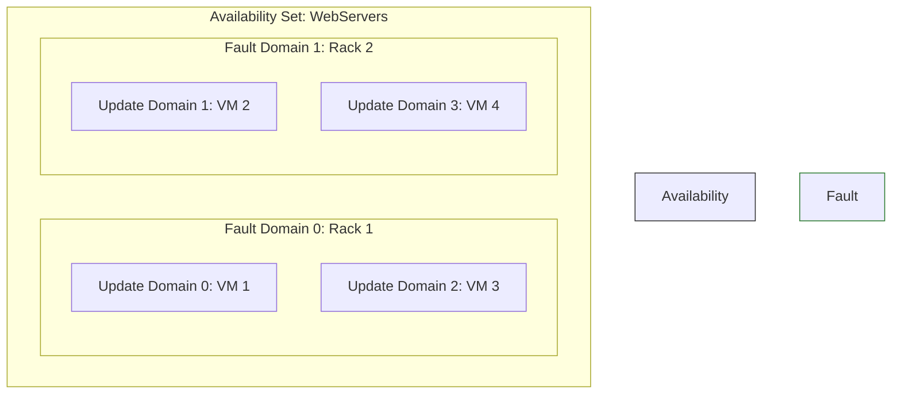

# Module 5: Deploy and Manage Azure Compute Resources

Compute is where your actual applications run. The AZ-104 exam requires you to know how to provision Virtual Machines, how to make them highly available, and when to use PaaS (App Services) or Container alternatives instead of IaaS (VMs).

---

## 1. Virtual Machine High Availability

If you deploy a single Virtual Machine, it has a 99.9% SLA. If the physical server rack it sits on needs a hardware reboot, your VM goes down. To achieve higher uptime (99.95% or 99.99%), you must deploy multiple VMs and group them.

### Availability Sets (SLA: 99.95%)
An Availability Set is a logical grouping of VMs *within the same datacenter*. It protects against hardware failures and planned maintenance.



- **Fault Domains (FD):** Think of these as physical server racks. They share a common power source and network switch. If Rack 1 loses power, Rack 2 stays up.
- **Update Domains (UD):** Think of these as reboot groups. When Microsoft pushes a mandatory hypervisor patch, they reboot UD0, wait for it to recover, then reboot UD1. This ensures your app is never fully offline during maintenance.

### Virtual Machine Scale Sets (VMSS)
While Availability Sets provide fault tolerance for a *fixed* number of VMs, VMSS provides **Autoscaling**. 
- You provide a "base image".
- You create rules (e.g., "If CPU > 75% for 10 minutes, add 2 VMs. If CPU < 25%, remove 1 VM").
- Azure automatically provisions and deletes identical VMs behind a Load Balancer to match traffic demand.

> [!WARNING]
> **Exam Gotcha:** If the exam asks how to deploy identical VMs that automatically increase in number based on metric demands, the answer is **VMSS**. If it asks how to protect two manually configured SQL servers from a rack failure, the answer is an **Availability Set**.

---

## 2. Azure App Service (PaaS)

You don't always need to manage the underlying OS. Azure App Service allows you to deploy your application code (C#, Python, Node.js) directly to the cloud. Microsoft handles the Windows/Linux servers underneath.

### App Service Plans
An App Service Plan is the virtual hardware you are renting. It defines the Region, OS, and Pricing Tier.
- **Multiple Apps:** You can run multiple web apps on a single App Service Plan. They all share the same CPU and RAM.
- **Deployment Slots:** Available in Standard tiers and above. Allows you to deploy code to a "Staging" slot, test it, and then instantly swap it with the "Production" slot with zero downtime.

---

## 3. Containers (ACI vs. AKS)

Containers package an application and its dependencies into a single, portable unit (Docker). 

1. **Azure Container Instances (ACI):** The fastest, simplest way to run a container in Azure. You do not manage any virtual machines. It is billed per second. Perfect for short-lived batch jobs or simple apps.
2. **Azure Kubernetes Service (AKS):** A massive, enterprise-grade container orchestration system. You manage the "Worker Nodes" (the VMs that run the containers), while Azure manages the "Control Plane" for free. Perfect for massive, scalable microservice architectures.

> [!IMPORTANT]
> **Exam Gotcha:** If the scenario requires running a simple containerized python script that executes once a day for 5 minutes and needs to be as cheap as possible with zero management overhead, choose **ACI**. If it requires complex auto-scaling of 50 microservices, choose **AKS**.

---

## 4. Custom Script Extensions

How do you install software on a VM immediately after it is created, without manually logging in via RDP or SSH?
- You use a **Virtual Machine Extension**.
- The **Custom Script Extension** automatically downloads and runs scripts (PowerShell or Bash) against the VM OS during the provisioning phase.

---

## 5. Portal Walkthrough: "Where to Click"

* **To configure VMSS Autoscale Rules:**
  * Navigate to the Virtual Machine Scale Set -> Click `Scaling` on the left menu -> Select `Custom autoscale` -> Click `+ Add a rule` -> Define the metric (e.g., CPU Percentage) and the action (Increase count by 1).
* **To create an App Service Deployment Slot:**
  * Navigate to the App Service -> Click `Deployment slots` -> Click `+ Add Slot` -> Give it a name (e.g., "staging") and choose whether to clone settings from production.
* **To inject a script via Custom Script Extension:**
  * Navigate to the VM -> Click `Extensions + applications` -> Click `+ Add` -> Select `Custom Script Extension` -> Upload your `.ps1` or `.sh` script file.

---

## 6. CLI & PowerShell Cheatsheet

### PowerShell
```powershell
# Create a new Virtual Machine
New-AzVm -ResourceGroupName "MyRG" -Name "MyVM" -Location "EastUS" -Image "Win2022Datacenter" -Size "Standard_DS1_v2"

# Restart a VM
Restart-AzVM -ResourceGroupName "MyRG" -Name "MyVM"
```

### Azure CLI
```bash
# Create a new Virtual Machine Scale Set with 2 initial instances
az vmss create --resource-group "MyRG" --name "MyScaleSet" --image "Ubuntu2204" --upgrade-policy-mode automatic --instance-count 2

# Create an Azure Container Instance
az container create --resource-group "MyRG" --name "mycontainer" --image "mcr.microsoft.com/azuredocs/aci-helloworld" --dns-name-label "aci-demo-123" --ports 80
```
