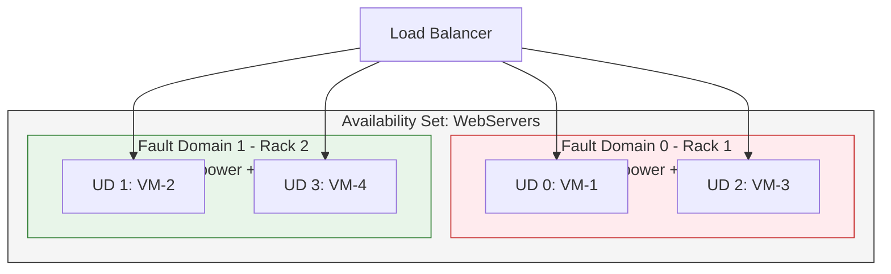
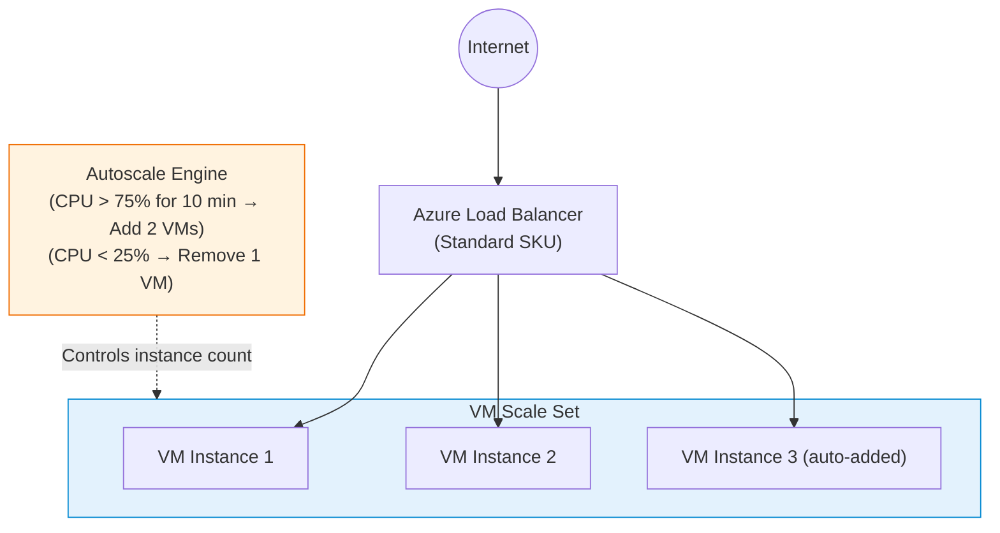

# Module 5: Deploy and Manage Azure Compute Resources

Compute is where your applications actually run. The AZ-104 exam requires you to know how to provision Virtual Machines, achieve high availability, and choose between IaaS (VMs), PaaS (App Service), and containers (ACI/AKS).

---

## 1. Compute Options Overview

| Service | Type | You Manage | Microsoft Manages | Best For |
| :--- | :--- | :--- | :--- | :--- |
| **Virtual Machine (VM)** | IaaS | OS, apps, runtime, data | Hardware, hypervisor | Full control, legacy apps, custom OS config |
| **VM Scale Sets (VMSS)** | IaaS | OS, apps, scaling rules | Hardware, load balancing | Auto-scaling stateless workloads |
| **Azure App Service** | PaaS | Application code and data | OS, runtime, patching, scaling | Web apps, APIs, no OS management |
| **Azure Container Instances (ACI)** | PaaS | Container image | Everything else | Short-lived, simple, serverless containers |
| **Azure Kubernetes Service (AKS)** | PaaS (managed control plane) | Worker nodes, workloads | Control plane (free) | Microservices, complex container orchestration |
| **Azure Functions** | Serverless | Code logic | Everything | Event-driven, short-burst tasks |

> [!TIP]
> **Decision pattern:** Need OS-level control? -> **VM**. Need auto-scaling identical VMs? -> **VMSS**. Need to just run code? -> **App Service**. Need a quick container? -> **ACI**. Need 50 microservices with auto-scaling? -> **AKS**.

---

## 2. Virtual Machine High Availability

A single VM has a 99.9% SLA (with Premium SSD). To achieve higher uptime, deploy multiple VMs using availability mechanisms.

### Availability SLA Comparison

| Configuration | SLA | Protects Against | Cost Impact |
| :--- | :--- | :--- | :--- |
| Single VM + Premium SSD | 99.9% | Hardware failure (best-effort) | Low |
| **Availability Set** (2+ VMs) | 99.95% | Rack failure + planned maintenance | Medium |
| **Availability Zones** (2+ VMs) | 99.99% | Full datacenter failure | Higher |
| Multi-region Active-Active | ~100% | Regional disaster | Highest |

> [!WARNING]
> **Exam Gotcha:** A single VM only gets a 99.9% SLA if it uses **Premium SSD or Ultra Disk**. Standard HDD/SSD single VMs have **no Microsoft-backed SLA**.

### Availability Sets: Fault Domains vs. Update Domains



| Concept | Definition | Max Count |
| :--- | :--- | :--- |
| **Fault Domain (FD)** | Physical server rack sharing power and network. Rack failure = FD failure. | Up to 3 FDs |
| **Update Domain (UD)** | Logical reboot group for planned maintenance. Azure reboots one UD at a time. | Up to 20 UDs |

> [!IMPORTANT]
> **Exam Gotcha:** Availability Sets protect within a **single datacenter**. They do NOT protect against a full datacenter failure. For datacenter-level protection, use **Availability Zones**.

---

## 3. Virtual Machine Scale Sets (VMSS)

VMSS provides automatic horizontal scaling of identical VMs behind a Load Balancer.

### VMSS Architecture



### Upgrade Policies

| Policy | Behavior | Use Case |
| :--- | :--- | :--- |
| **Automatic** | Azure upgrades instances immediately when image updates. | Stateless workloads |
| **Rolling** | Updates instances in batches to minimize downtime. | Production workloads |
| **Manual** | You control when each instance is upgraded. | Testing/controlled releases |

> [!WARNING]
> **Exam Gotcha:** VMSS is for deploying *identical* VMs from the same image. If you need two manually configured SQL servers protected from rack failure, use an **Availability Set**, not VMSS.

---

## 4. Azure App Service (PaaS)

App Service lets you deploy application code directly without managing underlying OS or servers.

### App Service Plan Tiers

| Tier | Features | SLA | Use Case |
| :--- | :--- | :--- | :--- |
| **Free / Shared** | No autoscale, no custom domain SSL, shared compute | None | Dev/test only |
| **Basic** | Custom domains, manual scale | 99.95% | Dev/test with custom domain |
| **Standard** | Autoscale, deployment slots (5), SSL | 99.95% | Production workloads |
| **Premium** | More slots (20), VNet integration, higher scale | 99.95% | Enterprise production |
| **Isolated** | Runs in your own dedicated VNet (App Service Environment) | 99.95% | High security / compliance |

> [!IMPORTANT]
> **Exam Gotcha:** **Deployment Slots** are available from **Standard tier and above**. You cannot use slot swaps (staging -> production zero-downtime swap) on Free or Basic plans.

### Key App Service Features

- **Deployment Slots:** Deploy to "staging", test it, then **swap** to "production" with zero downtime.
- **Auto-scaling:** Scale out based on CPU, memory, or schedule (Standard+).
- **VNet Integration:** Outbound access to resources in your VNet (Premium+).
- **Custom Domains & SSL:** Map your own domain and apply SSL certificates (Basic+).

---

## 5. Containers: ACI vs. AKS

| Feature | ACI (Azure Container Instances) | AKS (Azure Kubernetes Service) |
| :--- | :--- | :--- |
| **Management overhead** | None - fully serverless | Manage worker nodes; Azure manages control plane |
| **Startup time** | Seconds | Minutes (cluster provisioning) |
| **Scaling** | Manual / limited | Auto-scaling (HPA, cluster autoscaler) |
| **Billing** | Per second (CPU + memory) | Per worker node VM |
| **Networking** | Basic VNet integration | Full VNet integration, ingress controllers |
| **Best for** | Quick, simple, short-lived containers | Complex, long-running microservices |
| **Persistent storage** | Limited | Full PV/PVC with Azure Disks or Files |

> [!IMPORTANT]
> **Exam Gotcha:** Run a Python script once a day for 5 minutes with zero management = **ACI**. 50 auto-scaling microservices with complex networking = **AKS**.

---

## 6. VM Extensions & Custom Script

How do you configure a VM immediately after creation without manually logging in via RDP/SSH?

| Extension | What It Does | Platform |
| :--- | :--- | :--- |
| **Custom Script Extension** | Downloads and runs a script (PS1/Bash) on the VM. | Windows + Linux |
| **Desired State Configuration (DSC)** | Enforces a configuration state idempotently using PowerShell DSC. | Windows |
| **Azure Monitor Agent** | Installs monitoring and sends data to Log Analytics Workspace. | Windows + Linux |
| **Dependency Agent** | Maps VM connections for Azure Monitor Network Insights. | Windows + Linux |

---

## 7. VM Disk Types

| Disk Type | IOPS | Use Case | Cost |
| :--- | :--- | :--- | :--- |
| **Standard HDD** | Up to 2,000 | Dev/test, infrequent access | Lowest |
| **Standard SSD** | Up to 6,000 | Light production, web servers | Low |
| **Premium SSD** | Up to 20,000 | Production databases, critical apps | Medium |
| **Ultra Disk** | Up to 160,000 | High-throughput databases (SAP, SQL) | Highest |

> [!WARNING]
> **Exam Gotcha:** Only **Premium SSD** and **Ultra Disk** qualify for the 99.9% single-VM SLA. Standard HDD/SSD do NOT provide a Microsoft-backed SLA for single VMs.

---

## 8. Compute Best Practices

- **Never run production on a single VM:** Use Availability Sets (single-datacenter) or Zones (multi-datacenter).
- **Use VMSS for stateless tiers:** Web and app tiers should auto-scale; databases should not.
- **Right-size VMs regularly:** Use Azure Advisor to identify underutilized VMs.
- **Use Azure Bastion for RDP/SSH:** Never expose port 3389/22 directly to the internet.
- **Use Managed Disks:** Always prefer Managed Disks over unmanaged; they integrate with Availability Sets for automatic FD alignment.
- **Prefer App Service for web workloads:** Avoid IaaS VMs for simple web apps - App Service is cheaper and lower maintenance.
- **Tag VMs with environment and cost center:** Essential for cost reporting and governance.

---

## 9. Portal Walkthrough: "Where to Click"

* **To configure VMSS Autoscale Rules:**
  * VMSS -> `Scaling` -> Select `Custom autoscale` -> `+ Add a rule` -> Define metric (e.g., CPU%) and action (increase count by 1).
* **To create an App Service Deployment Slot:**
  * App Service -> `Deployment slots` -> `+ Add Slot` -> Name it "staging" -> Choose to clone settings from production.
* **To inject a script via Custom Script Extension:**
  * VM -> `Extensions + applications` -> `+ Add` -> Select `Custom Script Extension` -> Upload your `.ps1` or `.sh` file.
* **To check VM SLA eligibility:**
  * VM -> `Overview` -> Check disk type under "Disks" (must be Premium SSD for 99.9% SLA).

---

## 10. CLI & PowerShell Cheatsheet

### PowerShell
```powershell
# Create a new Virtual Machine
New-AzVm -ResourceGroupName "MyRG" -Name "MyVM" -Location "EastUS" -Image "Win2022Datacenter" -Size "Standard_DS1_v2"

# Resize a VM (must deallocate first)
Stop-AzVM -ResourceGroupName "MyRG" -Name "MyVM" -Force
Update-AzVM -ResourceGroupName "MyRG" -VM (Get-AzVM -ResourceGroupName "MyRG" -Name "MyVM") -Size "Standard_DS2_v2"

# Restart a VM
Restart-AzVM -ResourceGroupName "MyRG" -Name "MyVM"
```

### Azure CLI
```bash
# Create a VMSS with 2 initial instances
az vmss create --resource-group "MyRG" --name "MyScaleSet" --image "Ubuntu2204" --upgrade-policy-mode automatic --instance-count 2

# Create an Azure Container Instance
az container create --resource-group "MyRG" --name "mycontainer" --image "mcr.microsoft.com/azuredocs/aci-helloworld" --dns-name-label "aci-demo" --ports 80

# List available VM sizes in a region
az vm list-sizes --location "eastus" --output table
```
