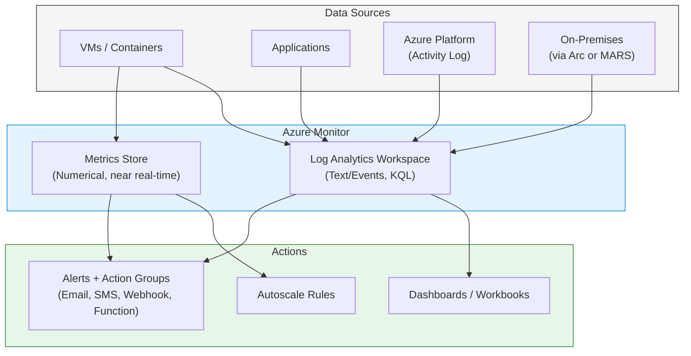
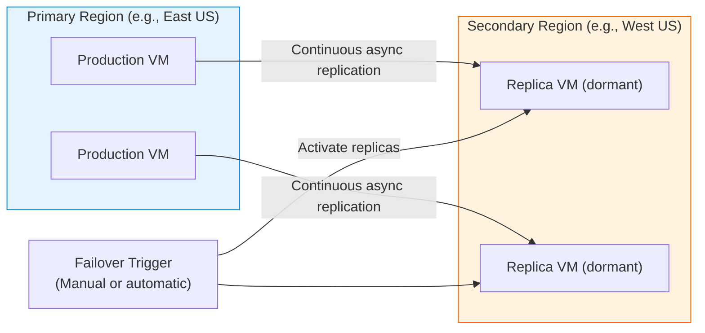

# Module 6: Monitor and Maintain Azure Resources

Once your infrastructure is running, you must ensure it stays healthy and data is never lost. The AZ-104 exam focuses on differentiating between monitoring tools and choosing the right backup architecture.

---

## 1. Monitoring Tools Overview

| Tool | What It Does | Data Type | Query Language |
| :--- | :--- | :--- | :--- |
| **Azure Monitor** | Central hub collecting all telemetry from Azure resources. | Metrics + Logs | KQL (for logs) |
| **Log Analytics Workspace** | Store and query log data from multiple sources. | Logs (text events) | KQL |
| **Application Insights** | APM tool for web apps - traces, exceptions, dependencies. | Traces, metrics | KQL |
| **Network Watcher** | Network-specific diagnostics (flow logs, packet capture, topology). | Flow logs, topology | - |
| **Azure Advisor** | Personalized recommendations across reliability, security, cost, performance. | Recommendations | - |
| **Azure Service Health** | Status of Azure services in your regions; planned maintenance alerts. | Service events | - |

---

## 2. Azure Monitor: Metrics vs. Logs



### Metrics vs. Logs

| Characteristic | Metrics | Logs |
| :--- | :--- | :--- |
| **Data format** | Numerical values over time | Text-based event records |
| **Examples** | CPU %, Disk IOPS, Network bytes | Event Viewer, Syslog, app exceptions |
| **Latency** | Near real-time (seconds) | Minutes (collected and ingested) |
| **Storage** | Azure Monitor Metrics store (93 days default) | Log Analytics Workspace (configurable retention) |
| **Query** | Metrics Explorer (no query language) | KQL in Log Analytics |
| **Best for** | Fast alerts, autoscale triggers | Root cause analysis, compliance, audit |

> [!TIP]
> **Pattern:** Use **Metrics** for triggering fast alerts (e.g., CPU > 90% for 5 min). Use **Logs** for complex queries and root cause analysis (e.g., "Which IP made the most failed login attempts this week?").

---

## 3. Diagnostic Settings

By default, most Azure resources do NOT send data to Log Analytics. You must configure **Diagnostic Settings** to route telemetry.

| Destination | Use Case |
| :--- | :--- |
| **Log Analytics Workspace** | Query with KQL, create alerts, build dashboards |
| **Storage Account** | Long-term archive at low cost |
| **Event Hub** | Stream to third-party SIEM tools (Splunk, Sentinel) |
| **Partner Solution** | Direct integration with monitoring partners |

> [!IMPORTANT]
> **Exam Gotcha:** Diagnostic settings must be configured **per resource**. Enabling it at a subscription level (Activity Log) only captures control-plane events (who did what). Resource-level diagnostics (e.g., NSG flow logs, VM performance counters) require separate configuration.

---

## 4. Alerts and Action Groups

| Component | Definition |
| :--- | :--- |
| **Alert Rule** | Defines the condition (metric threshold, log query, activity log event). |
| **Action Group** | Defines what happens when the alert fires (notifications + automation). |
| **Alert Severity** | Sev 0 (Critical) to Sev 4 (Verbose); used for filtering and routing. |

### Action Group Notification Types

| Type | Use Case |
| :--- | :--- |
| **Email / SMS / Voice** | Notify an individual or distribution list |
| **Azure App Push** | Notify via Azure mobile app |
| **Webhook** | Call any HTTP endpoint (e.g., PagerDuty, ServiceNow) |
| **Azure Function** | Trigger serverless automation |
| **Logic App** | Trigger a complex workflow |
| **Automation Runbook** | Execute a PowerShell runbook in Azure Automation |
| **ITSM Connector** | Integrate with ServiceNow, Cherwell, etc. |

---

## 5. Azure Backup

Azure Backup is a centralized service to back up data to a **Recovery Services Vault**.

### Backup Methods Compared

| Method | What It Backs Up | Platform | Agent Required |
| :--- | :--- | :--- | :--- |
| **Azure VM Backup (native)** | Full VM snapshot (OS + all disks) | Azure VMs only | No (uses VM extension) |
| **MARS Agent** | Files, folders, System State | Windows only (on-prem or Azure VM) | YES - install manually |
| **MABS (Microsoft Azure Backup Server)** | Full workloads: SQL, Exchange, SharePoint, Hyper-V VMs | Windows/Linux (on-prem) | YES - full server install |
| **Azure Backup for SQL in VM** | SQL Server databases with point-in-time recovery | SQL on Azure VMs | YES - extension |
| **Azure Backup for Azure Files** | Azure File Share snapshots | Azure Files | No |

> [!WARNING]
> **Exam Gotcha:** MARS Agent is **Windows only** - it cannot back up Linux machines directly. For on-premises Linux servers, use **MABS** or **Azure Site Recovery**. This is the most commonly tested backup limitation.

### Recovery Services Vault vs. Backup Vault

| | Recovery Services Vault | Backup Vault |
| :--- | :--- | :--- |
| **Supports** | Azure VMs, SQL in VMs, MARS, MABS, Azure Files | Azure Disks, Azure Blobs, AKS, PostgreSQL |
| **Site Recovery** | ✅ | ❌ |
| **Redundancy options** | LRS or GRS | LRS or GRS |

---

## 6. Backup Policy (RPO and RTO)

| Term | Definition | Goal |
| :--- | :--- | :--- |
| **RPO (Recovery Point Objective)** | Maximum acceptable data loss (how old can a restore point be?). | Minimize data loss |
| **RTO (Recovery Time Objective)** | Maximum acceptable downtime (how fast must you be back online?). | Minimize downtime |

> [!IMPORTANT]
> **Exam Gotcha:** **Backup** addresses **RPO** (restoring data to a point in time). **Azure Site Recovery** addresses **RTO** (keeping the business online with fast failover). If a question asks about replicating VMs to a secondary region to minimize downtime during a regional failure, the answer is **Azure Site Recovery**, not Azure Backup.

---

## 7. Azure Site Recovery (ASR)

ASR continuously replicates VMs from a Primary Region to a Secondary Region for disaster recovery.



**Key ASR Features:**
- **Test Failover:** Run a drill without affecting production (uses an isolated VNet).
- **Failover:** Actual failover to secondary region during a disaster.
- **Failback:** Return to primary region after it recovers.
- **RPO:** As low as 30 seconds for VMware; 5 minutes for Hyper-V.

---

## 8. Azure Advisor

Azure Advisor is a free, personalized cloud consultant analyzing your environment across 5 pillars:

| Pillar | Example Recommendation |
| :--- | :--- |
| **Reliability** | "Your VM is not in an Availability Set or Zone." |
| **Security** | "Port 3389 (RDP) is open to the internet." |
| **Cost** | "This VM has had 1% CPU usage for 30 days - consider downsizing." |
| **Performance** | "Add a read replica to your SQL database to reduce latency." |
| **Operational Excellence** | "Create an Azure Service Health alert for your regions." |

---

## 9. Monitoring Best Practices

- **Enable Diagnostic Settings on all resources:** Default telemetry is minimal; you must explicitly route logs.
- **Centralize to a single Log Analytics Workspace:** Use workspace-level RBAC for multi-team access.
- **Set alert severity correctly:** Sev 0/1 for critical business impact; Sev 3/4 for informational.
- **Use Action Groups for all alerts:** Never set up individual email alerts per metric; manage centrally.
- **Enable NSG Flow Logs:** Essential for security and network troubleshooting.
- **Configure Activity Log retention:** Default is 90 days. Export to Log Analytics for longer retention.
- **Use Azure Monitor Workbooks:** Create interactive reports for teams (no Grafana needed).
- **Test your backup restore:** Regularly perform test restores - a backup that was never tested may not work.
- **Set backup retention to match compliance requirements:** 7 years for financial data, for example.

---

## 10. Portal Walkthrough: "Where to Click"

* **To create an Action Group:**
  * `Monitor` -> `Alerts` -> `Action groups` -> `+ Create` -> Under Notifications, select `Email/SMS/Push/Voice`.
* **To configure a VM Backup:**
  * VM -> `Backup` (left menu, under Operations) -> Create/select Recovery Services Vault -> Choose Backup Policy -> `Enable backup`.
* **To configure Diagnostic Settings for a resource:**
  * Resource -> `Diagnostic settings` (under Monitoring section) -> `+ Add diagnostic setting` -> Select log categories -> Choose destination (Log Analytics, Storage, Event Hub).
* **To view Advisor recommendations:**
  * Search `Advisor` -> Click the `Cost`, `Reliability`, or `Security` tiles.

---

## 11. CLI & PowerShell Cheatsheet

### PowerShell
```powershell
# Create a new Recovery Services Vault
New-AzRecoveryServicesVault -ResourceGroupName "MyRG" -Name "MyBackupVault" -Location "EastUS"

# Set vault context for subsequent backup commands
Get-AzRecoveryServicesVault -Name "MyBackupVault" | Set-AzRecoveryServicesVaultContext

# Enable backup for a VM
$policy = Get-AzRecoveryServicesBackupProtectionPolicy -Name "DefaultPolicy"
Enable-AzRecoveryServicesBackupProtection -Policy $policy -Name "MyVM" -ResourceGroupName "MyRG"
```

### Azure CLI
```bash
# Create a Log Analytics Workspace
az monitor log-analytics workspace create --resource-group "MyRG" --workspace-name "MyLogWorkspace"

# Create a Recovery Services Vault
az backup vault create --resource-group "MyRG" --name "MyBackupVault" --location "eastus"

# Enable Azure Monitor diagnostic settings for a VM
az monitor diagnostic-settings create --name "VMDiagnostics" --resource <vm-resource-id> --workspace <workspace-id> --metrics '[{"category":"AllMetrics","enabled":true}]'
```
